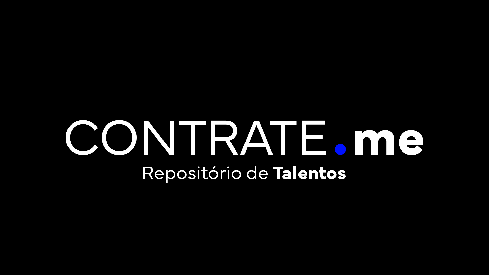
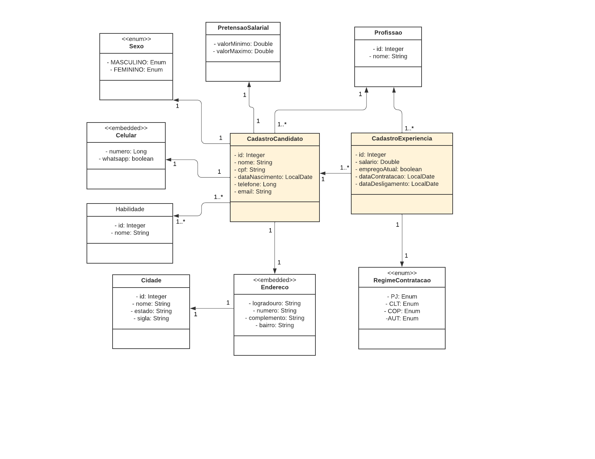
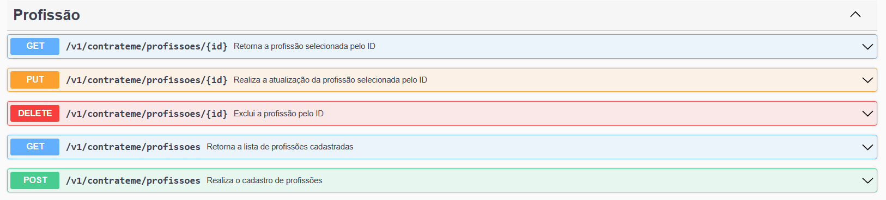
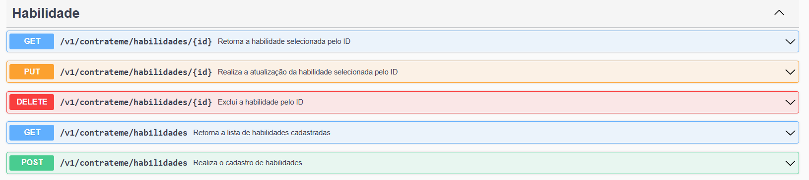
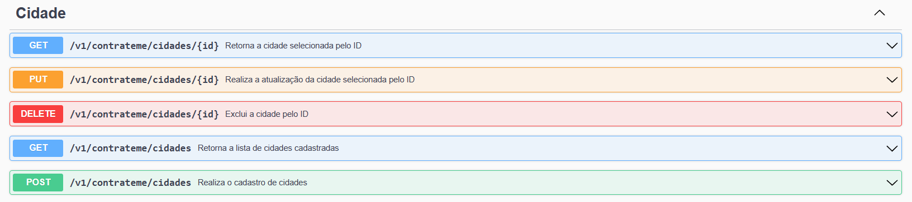
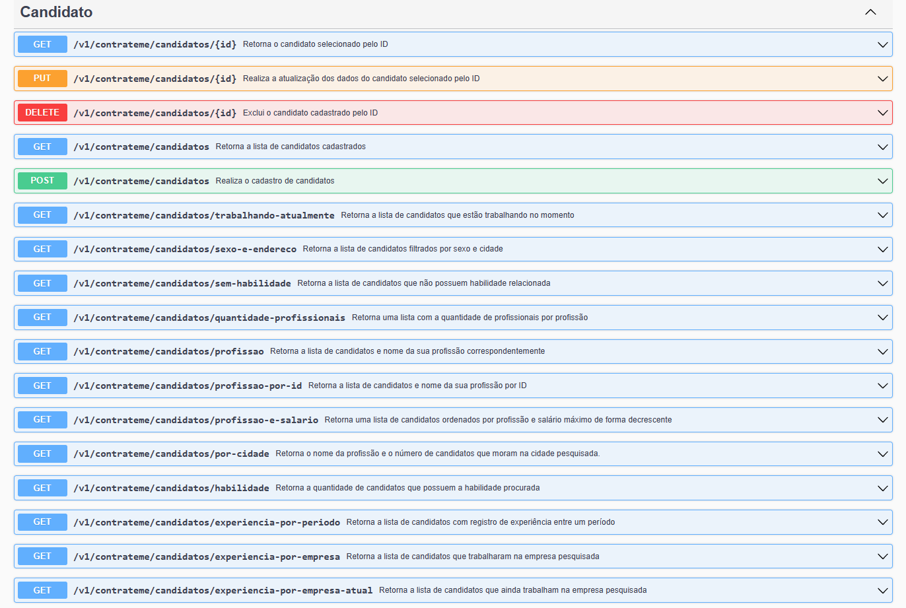

<p align="center">
  
</p>

<h1 align="center">CONTRATE.me - Projeto Final da MJV School Java</h1>

<p align="justify"> <b>CONTRATE.me</b> é uma plataforma que simplifica o recrutamento e seleção de talentos na área de tecnologia. É um repositório centralizado onde profissionais podem armazenar suas informações pessoais e profissionais, destacando suas experiências e habilidades. As empresas podem usar a plataforma para encontrar candidatos qualificados, realizando pesquisas avançadas e entrando em contato diretamente com os profissionais. É uma solução eficiente para conectar talentos e oportunidades de emprego na tecnologia. </p>

## Documentação 📝

A API conta com uma documentação detalhada disponível no <i>Swagger</i>, que pode ser acessada pelo link: [Contrate.me](http://localhost:8080/swagger-ui/index.html#/)

## Tecnologias e Ferramentas ⚙️

<p align="justify"> Foi utilizado <i>Spring Data JPA</i> para implementar a camada de persistência da dados.

**Linguagem:** Java (<i>versão: 11</i>)

**Framework:** Spring Boot (<i>versão: 2.7.9</i>)
      
- <i>Dependências do Spring</i> : DataJPA | Validation |  Starter WEB | DevTools | Lombok | MySQL | Swagger | ModelMapper

**Banco de Dados:** MySQL

**Plataforma de API:** Postman

**Documentação da API:** Swagger

**IDE:** IntelliJ IDEA

**Modelagem UML:** Lucidchart
</p>

## Diagrama UML 📈

  

## Estrutura e Pacotes 🗂️

- configs
- DTOs
- enums
- exceptions
- models
- repositories
- resources
- services

## Schemas - JSON 📋

**PROFISSÕES**

```json
{
  "nome": "Desenvolvedor de Sistemas Java Jr"
}
```

__________________________

**HABILIDADES** 

```json
{
  "nome": "Java"
}
```
  
__________________________

**CIDADES**
```json
{
  "nome": "Curitiba",
  "estado": "Paraná",
  "sigla": "PR"
}
```

__________________________

**CANDIDATOS**

```json
{
  "nome": "Maria Silva",
  "cpf": "441.570.480-83",
  "dataNascimento": "12/05/1990",
  "sexo": "FEMININO",
  "email": "maria.silva@gmail.com",
  "profissao": 1,
  "telefoneCelular": {
    "numero": "5511987654321",
    "whatsapp": true
  },
  "telefoneFixo": "551112345678",
  "endereco": {
    "bairro": "Centro",
    "cep": "12345000",
    "cidade": 17,
    "logradouro": "Rua das Flores",
    "numeroEndereco": "123",
    "complemento": "Apartamento 456"
  },
  "pretensaoSalarial": {
    "valorMaximo": 4000.00,
    "valorMinimo": 2500.00
  },
  "habilidades": [1, 2, 3, 4],
  "experiencias": [
    {
      "dataContratacao": "01/03/2010",
      "empregoAtual": false,
      "empresa": "ABC Comércio",
      "profissao": 3,
      "regimeContratacao": "CLT",
      "salario": 3500.00,
      "dataDesligamento": "31/12/2019"
    },
    {
      "dataContratacao": "01/01/2020",
      "empregoAtual": true,
      "empresa": "XYZ Indústria",
      "profissao": 3,
      "regimeContratacao": "CLT",
      "salario": 4200.00,
      "dataDesligamento": ""
    }
  ]
}
```

## Rotas 🧭

**PROFISSÃO**



_____________________________

**HABILIDADE**



_____________________________

**CIDADE**



_______________________________

**CANDIDATO**



## Colaboradores 💻

- <a href="https://github.com/EriksonsSilva"> Erikson Silva </a>
- <a href="https://github.com/fabiopenha"> Fábio Penha </a>
- <a href="https://github.com/JonathanZapotosczny"> Jonathan Zapotosczny </a>
- <a href="https://github.com/Juuwes"> Juliana Gonçalves </a>
- <a href="https://github.com/JulioDinis"> Julio Dinis </a>
- <a href="https://github.com/KaylaDeodato"> Kayla Deodato </a>
- <a href="https://github.com/VictorAlmeida98"> Victor Almeida </a>
